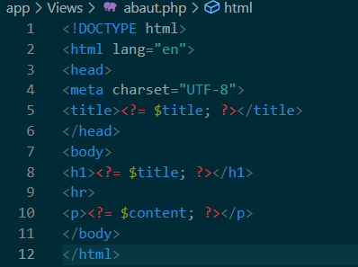
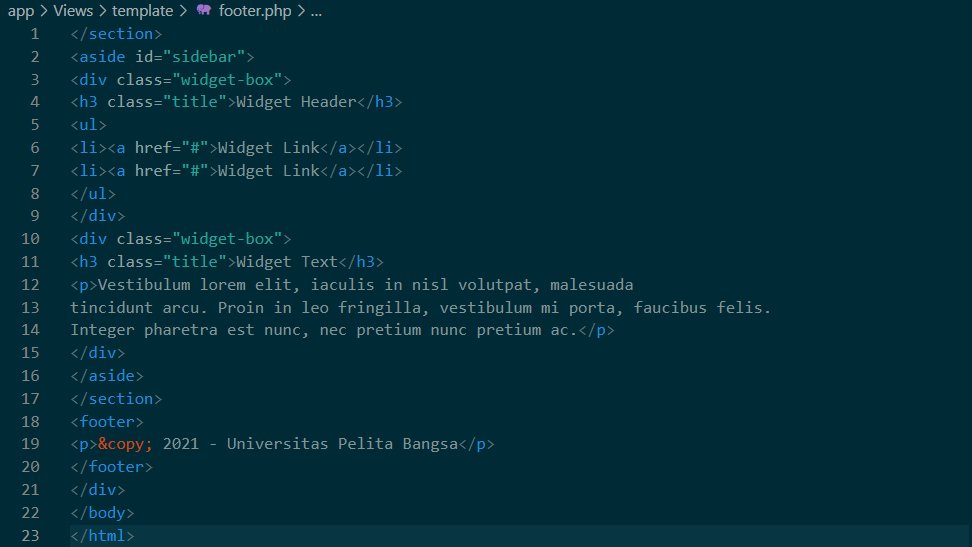

# Lab11Web

| Nama   | Fikri abei |
|--------|------------|
| Nim    | 312010417  |
| Kelas  | TI.20.A.1  |
| Matkul | pemograman web |

# Langkah-langkah Praktikum
Persiapan
Sebelum memulai menggunakan Framework Codeigniter, perlu dilakukan konfigurasi
pada webserver. Beberapa ekstensi PHP perlu diaktifkan untuk kebutuhan
pengembangan Codeigniter 4.
Berikut beberapa ekstensi yang perlu diaktifkan:
• php-json ekstension untuk bekerja dengan JSON;
• php-mysqlnd native driver untuk MySQL;
• php-xml ekstension untuk bekerja dengan XML;
• php-intl ekstensi untuk membuat aplikasi multibahasa;
• libcurl (opsional), jika ingin pakai Curl.
Untuk mengaktifkan ekstentsi tersebut, melalu XAMPP Control Panel, pada bagian
Apache klik Config -> PHP.ini


Pada bagian extention, hilangkan tanda ; (titik koma) pada ekstensi yang akan
diaktifkan. Kemudian simpan kembali filenya dan restart Apache web server.


# Instalasi Codeigniter 4
Untuk melakukan instalasi Codeigniter 4 dapat dilakukan dengan dua cara, yaitu cara
manual dan menggunakan composer. Pada praktikum ini kita menggunakan cara
manual.

• Unduh Codeigniter dari website https://codeigniter.com/download
• Extrak file zip Codeigniter ke direktori htdocs/lab11_ci.
• Ubah nama direktory framework-4.x.xx menjadi ci4.
• Buka browser dengan alamat http://localhost/lab11_ci/ci4/public/


# Menjalankan CLI (Command Line Interface)
Codeigniter 4 menyediakan CLI untuk mempermudah proses development. Untuk
mengakses CLI buka terminal/command prompt.


Arahkan lokasi direktori sesuai dengan direktori kerja project dibuat
(xampp/htdocs/lab11_ci/ci4/)
Perintah yang dapat dijalankan untuk memanggil CLI Codeigniter adalah:


# Mengaktifkan Mode Debugging
Codeigniter 4 menyediakan fitur debugging untuk memudahkan developer untuk
mengetahui pesan error apabila terjadi kesalahan dalam membuat kode program.
Secara default fitur ini belum aktif. Ketika terjadi error pada aplikasi akan ditampilkan
pesan kesalahan seperti berikut.


Semua jenis error akan ditampilkan sama. Untuk memudahkan mengetahui jenis
errornya, maka perlu diaktifkan mode debugging dengan mengubah nilai konfigurasi
pada environment variable CI_ENVIRINMENT menjadi development.


Ubah nama file env menjadi .env kemudian buka file tersebut dan ubah nilai variable
CI_ENVIRINMENT menjadi development.

Contoh error yang terjadi. Untuk mencoba error tersebut, ubah kode pada file
app/Controller/Home.php hilangkan titik koma pada akhir kode.


# Struktur Direktori

Untuk lebih memahami Framework Codeigniter 4 perlu mengetahui struktur direktori
dan file yang ada. Buka pada Windows Explorer atau dari Visual Studio Code ->
# Open Folder.
Terdapat beberapa direktori dan file yang perlu dipahami fungsi dan kegunaannya.
• .github folder ini kita butuhkan untuk konfigurasi repo github, seperti konfigurasi
untuk build dengan github action;
• app folder ini akan berisi kode dari aplikasi yang kita kembangkan;
• public folder ini berisi file yang bisa diakses oleh publik, seperti file index.php,
robots.txt, favicon.ico, ads.txt, dll;
• tests folder ini berisi kode untuk melakukan testing dengna PHPunit;

• vendor folder ini berisi library yang dibutuhkan oleh aplikasi, isinya juga termasuk
kode core dari system CI.
• writable folder ini berisi file yang ditulis oleh aplikasi. Nantinya, kita bisa pakai
untuk menyimpan file yang di-upload, logs, session, dll.
Sedangkan file-file yang berada pada root direktori CI sebagai berikut.
• .env adalah file yang berisi variabel environment yang dibutuhkan oleh aplikasi.
• .gitignore adalah file yang berisi daftar nama file dan folder yang akan diabaikan
oleh Git.
• build adalah script untuk mengubah versi codeigniter yang digunakan. Ada versi
release (stabil) dan development (labil).
• composer.json adalah file JSON yang berisi informasi tentang proyek dan daftar
library yang dibutuhkannya. File ini digunakan oleh Composer sebagai acuan.
• composer.lock adalah file yang berisi informasi versi dari libraray yang digunakan
aplikasi.
• license.txt adalah file yang berisi penjelasan tentang lisensi Codeigniter;
• phpunit.xml.dist adalah file XML yang berisi konfigurasi untuk PHPunit.
• README.md adalah file keterangan tentang codebase CI. Ini biasanya akan
dibutuhkan pada repo github atau gitlab.
• spark adalah program atau script yang berfungsi untuk menjalankan server,
generate kode, dll.


Fokus kita pada folder app, dimana folder tersebut adalah area kerja kita untuk
membuat aplikasi. Dan folder public untuk menyimpan aset web seperti css, gambar,
javascript, dll.

# Memahami Konsep MVC
Codeigniter menggunakan konsep MVC. MVC meripakan singkatan dari
Model-View-Controller. MVC merupakan konsep arsitektur yang umum digunakan
dalam pengembangan aplikasi. Konsep MVC adalah memisahkan kode program
berdasarkan logic proses, data, dan tampilan. Untuk logic proses diletakkan pada
direktori Contoller, Objek data diletakkan pada direktori Model, dan desain tampilan
diletakkan pada direktori View.
Codeigniter menggunakan konsep pemrograman berorientasi objek dalam
mengimplementasikan konsep MVC.
# Model 
merupakan kode program yang berisi pemodelan data. Data dapat berupa
database ataupun sumber lainnya.
# View 
merupakan kode program yang berisi bagian yang menangani terkait tampilan
user interface sebuah aplikasi. didalam aplikasi web biasanya pasti akan berhubungan
dengan html dan css.
# Controller
 merupakaan kode program yang berkaitan dengan logic proses yang
menghubungkan antara view dan model. Controller berfungsi untuk menerima request
dan data dari user kemudian diproses dengan menghubungkan bagian model dan view.
# Routing dan Controller
Routing merupakan proses yang mengatur arah atau rute dari request untuk menentukan
fungsi/bagian mana yang akan memproses request tersebut. Pada framework CI4,
routing bertujuan untuk menentukan Controller mana yang harus merespon sebuah
request. Controller adalah class atau script yang bertanggung jawab merespon sebuah
request.
Pada Codeigniter, request yang diterima oleh file index.php akan diarahkan ke Router
untuk meudian oleh router tesebut diarahkan ke Controller.
Router terletak pada file app/config/Routes.php


Pada file tersebut kita dapat mendefinisikan route untuk aplikasi yang kita buat.
Contoh:


Kode tersebut akan mengarahkan rute untuk halaman home.
# Membuat Route Baru.
Tambahkan kode berikut di dalam Routes.php


Untuk mengetahui route yang ditambahkan sudah benar, buka CLI dan jalankan
perintah berikut.

php spark routes


Selanjutnya coba akses route yang telah dibuat dengan mengakses alamat url
http://localhost:8080/about


Ketika diakses akan mucul tampilan error 404 file not found, itu artinya file/page
tersebut tidak ada. Untuk dapat mengakses halaman tersebut, harus dibuat terlebih
dahulu Contoller yang sesuai dengan routing yang dibuat yaitu Contoller Page.

# Membuat Controller
Selanjutnya adalah membuat Controller Page. Buat file baru dengan nama page.php
pada direktori Controller kemudian isi kodenya seperti berikut.


Selanjutnya refresh Kembali browser, maka akan ditampilkan hasilnya yaotu halaman
sudah dapat diakses.


# Auto Routing
Secara default fitur autoroute pada Codeiginiter sudah aktif. Untuk mengubah status autoroute dapat mengubah nilai variabelnya. Untuk menonaktifkan ubah nilai true menjadi false.


Tambahkan method baru pada Controller Page seperti berikut.


Method ini belum ada pada routing, sehingga cara mengaksesnya dengan menggunakan
alamat: http://localhost:8080/page/tos


# Membuat View
Selanjutnya adalam membuat view untuk tampilan web agar lebih menarik. Buat file
baru dengan nama about.php pada direktori view (app/view/about.php) kemudian isi
kodenya seperti berikut.



Ubah method about pada class Controller Page menjadi seperti berikut:


Kemudian lakukan refresh pada halaman tersebut.


# Membuat Layout Web dengan CSS
Pada dasarnya layout web dengan css dapat diimplamentasikan dengan mudah pada
codeigniter. Yang perlu diketahui adalah, pada Codeigniter 4 file yang menyimpan asset
css dan javascript terletak pada direktori public.
Buat file css pada direktori public dengan nama style.css (copy file dari praktikum
lab4_layout. Kita akan gunakan layout yang pernah dibuat pada praktikum 4.


Kemudian buat folder template pada direktori view kemudian buat file header.php dan
footer.php
File app/view/template/header.php


File app/view/template/footer.php



Kemudian ubah file app/view/about.php seperti berikut.


Selanjutnya refresh tampilan pada alamat http://localhost:8080/about


Pertanyaan dan Tugas
Lengkapi kode program untuk menu lainnya yang ada pada Controller Page, sehingga
semua link pada navigasi header dapat menampilkan tampilan dengan layout yang
sama.
Laporan Praktikum
1. Buatlah repository baru dengan nama Lab11Web.
2. Kerjakan semua latihan yang diberikan sesuai urutannya.
3. Screenshot setiap perubahannya.
4. Buatlah file README.md dan tuliskan penjelasan dari setiap langkah praktikum
beserta screenshotnya.
5. Commit hasilnya pada repository masing-masing.
6. Kirim URL repository pada e-learning ecampus


# Praktikum 13: Framework Lanjutan (Modul Login)

# Langkah-langkah Praktikum
Persiapan.
Untuk memulai membuat modul Login, yang perlu disiapkan adalah database server
menggunakan MySQL. Pastikan MySQL Server sudah dapat dijalankan melalui
XAMPP.
# Membuat Tabel User

```php

CREATE TABLE user (
id INT(11) auto_increment,
username VARCHAR(200) NOT NULL,
useremail VARCHAR(200),
userpassword VARCHAR(200),
PRIMARY KEY(id)
);
```

# Membuat Model User
Selanjutnya adalah membuat Model untuk memproses data Login. Buat file baru pada
direktori app/Models dengan nama UserModel.php

```php

<?php
namespace App\Models;
use CodeIgniter\Model;
class UserModel extends Model
{
protected $table = 'user';
protected $primaryKey = 'id';
protected $useAutoIncrement = true;
protected $allowedFields = ['username', 'useremail', 'userpassword'];
}
```

# Membuat Controller User
Buat Controller baru dengan nama User.php pada direktori app/Controllers.
Kemudian tambahkan method index() untuk menampilkan daftar user, dan method
login() untuk proses login.

```php

<?php
namespace App\Controllers;
use App\Models\UserModel;
class User extends BaseController
{
public function index()
{
$title = 'Daftar User';
$model = new UserModel();
$users = $model->findAll();
return view('user/index', compact('users', 'title'));
}
public function login()
{
helper(['form']);
$email = $this->request->getPost('email');
$password = $this->request->getPost('password');
if (!$email)
{
return view('user/login');
}
$session = session();
$model = new UserModel();
$login = $model->where('useremail', $email)->first();
if ($login)
{
$pass = $login['userpassword'];
if (password_verify($password, $pass))
{
$login_data = [
    'user_id' => $login['id'],
'user_name' => $login['username'],
'user_email' => $login['useremail'],
'logged_in' => TRUE,
];
$session->set($login_data);
return redirect('admin/artikel');
}
else
{
$session->setFlashdata("flash_msg", "Password salah.");
return redirect()->to('/user/login');
}
}
else
{
$session->setFlashdata("flash_msg", "email tidak terdaftar.");
return redirect()->to('/user/login');
}
}
```

# Membuat View Login
Buat direktori baru dengan nama user pada direktori app/views, kemudian buat file
baru dengan nama login.php.

```php
<!DOCTYPE html>
<html lang="en">
<head>
<meta charset="UTF-8">
<title>Login</title>
<link rel="stylesheet" href="<?= base_url('/style.css');?>">
</head>
<body>
<div id="login-wrapper">
<h1>Sign In</h1>
<?php if(session()->getFlashdata('flash_msg')):?>
<div class="alert alert-danger"><?=
session()->getFlashdata('flash_msg') ?></div>
<?php endif;?>
<form action="" method="post">
<div class="mb-3">
<label for="InputForEmail" class="form-label">Email
address</label>
<input type="email" name="email" class="form-control"
id="InputForEmail" value="<?= set_value('email') ?>">
</div>
<div class="mb-3">
<label for="InputForPassword"
class="form-label">Password</label>
<input type="password" name="password"
class="form-control" id="InputForPassword">
</div>
<button type="submit" class="btn
btn-primary">Login</button>
</form>
</div>
</body>
</html>
```

# Membuat Database Seeder
Database seeder digunakan untuk membuat data dummy. Untuk keperluan ujicoba modul
login, kita perlu memasukkan data user dan password kedaalam database. Untuk itu buat
database seeder untuk tabel user. Buka CLI, kemudian tulis perintah berikut:

``php spark make:seeder UserSeeder``

Selanjutnya, buka file UserSeeder.php yang berada di lokasi direktori
/app/Database/Seeds/UserSeeder.php kemudian isi dengan kode berikut:

```php
<?php
namespace App\Database\Seeds;
use CodeIgniter\Database\Seeder;
class UserSeeder extends Seeder
{
public function run()
{
$model = model('UserModel');
$model->insert([
'username' => 'admin',
'useremail' => 'admin@email.com',
'userpassword' => password_hash('admin123', PASSWORD_DEFAULT),
]);
}
}
```

Selanjutnya buka kembali CLI dan ketik perintah berikut:

``php spark db:seed UserSeeder``

Uji Coba Login
Selanjutnya buka url http://localhost:8080/user/login seperti berikut:


# Menambahkan Auth Filter
Selanjutnya membuat filer untuk halaman admin. Buat file baru dengan nama Auth.php
pada direktori app/Filters.

```php
<?php namespace App\Filters;
use CodeIgniter\HTTP\RequestInterface;
use CodeIgniter\HTTP\ResponseInterface;
use CodeIgniter\Filters\FilterInterface;
class Auth implements FilterInterface
{
public function before(RequestInterface $request, $arguments = null)
{
// jika user belum login
if(! session()->get('logged_in')){
// maka redirct ke halaman login
return redirect()->to('/user/login');
}
}
public function after(RequestInterface $request, ResponseInterface
$response, $arguments = null)
{
// Do something here
}
}
```

Selanjutnya buka file app/Config/Filters.php tambahkan kode berikut:

``'auth' => App\Filters\Auth::class``

```php
public $aliases = [
        'csrf'          => CSRF::class,
        'toolbar'       => DebugToolbar::class,
        'honeypot'      => Honeypot::class,
        'auth' => App\Filters\Auth::class,
        'invalidchars'  => InvalidChars::class,
        'secureheaders' => SecureHeaders::class,
    ];
```
Selanjutnya buka file app/Config/Routes.php dan sesuaikan kodenya.

```php
$routes->get('/artikel/(:any)', 'Artikel::view/$1');
$routes->group('admin', ['filters' => 'auth'], function ($routes) {
    $routes->get('artikel', 'Artikel::admin_index');
    $routes->add('artikel/add', 'Artikel::add');
    $routes->add('artikel/edit/(:any)', 'Artikel::edit/$1');
    $routes->get('artikel/delete/(:any)', 'Artikel::delete/$1');
});
```

# Percobaan Akses Menu Admin.
Buka url dengan alamat http://localhost:8080/admin/artikel ketika alamat tersebut
diakses maka, akan dimuculkan halaman login.


# Fungsi Logout
Tambahkan method logout pada Controller User seperti berikut:
```php
public function logout()
{
session()->destroy();
return redirect()->to('/user/login');
}
```

Pertanyaan dan Tugas
Selesaikan programnya sesuai Langkah-langkah yang ada. Anda boleh melakukan
improvisasi.
Laporan Praktikum
1. Melanjutkan praktikum sebelumnya pada repository dengan nama Lab11Web.
2. Kerjakan semua latihan yang diberikan sesuai urutannya.
3. Screenshot setiap perubahannya.
4. Update file README.md dan tuliskan penjelasan dari setiap langkah praktikum
beserta screenshotnya.
5. Commit hasilnya pada repository masing-masing.
6. Kirim URL repository pada e-learning ecampus


# Praktikum 14: Pagination dan Pencarian

# Langkah-langkah Praktikum
Membuat Pagination
Pagination merupakan proses yang digunakan untuk membatasi tampilan yang panjang
dari data yang banyak pada sebuah website. Fungsi pagination adalah memecah
tampilan menjadi beberapa halaman tergantung banyaknya data yang akan ditampilkan
pada setiap halaman.
Pada Codeigniter 4, fungsi pagination sudah tersedia pada Library sehingga cukup
mudah menggunakannya.
Untuk membuat pagination, buka Kembali Controller Artikel, kemudian modifikasi
kode pada method admin_index seperti berikut.
```php
public function admin_index()
{
$title = 'Daftar Artikel';
$model = new ArtikelModel();
$data = [
'title' => $title,
'artikel' => $model->paginate(10), #data dibatasi 10 record per
halaman
'pager' => $model->pager,
];
return view('artikel/admin_index', $data);
}
```

Kemudian buka file views/artikel/admin_index.php dan tambahkan kode berikut
dibawah deklarasi tabel data.

``<?= $pager->links(); ?>``

Selanjutnya buka kembali menu daftar artikel, tambahkan data lagi untuk melihat
hasilnya.


```php
Membuat Pencarian
Pencarian data digunakan untuk memfilter data.
Untuk membuat pencarian data, buka kembali Controller Artikel, pada method
admin_index ubah kodenya seperti berikut

public function admin_index()
{
$title = 'Daftar Artikel';
$q = $this->request->getVar('q') ?? '';
$model = new ArtikelModel();
$data = [
'title' => $title,
'q' => $q,
'artikel' => $model->like('judul', $q)->paginate(10), # data
dibatasi 10 record per halaman
'pager' => $model->pager,
];
return view('artikel/admin_index', $data);
}
```
Kemudian buka kembali file views/artikel/admin_index.php dan tambahkan form
pencarian sebelum deklarasi tabel seperti berikut:

```php
<form method="get" class="form-search">
<input type="text" name="q" value="<?= $q; ?>" placeholder="Cari data">
<input type="submit" value="Cari" class="btn btn-primary">
</form>
```

Dan pada link pager ubah seperti berikut.

``<?= $pager->only(['q'])->links(); ?>``

Selanjutnya ujicoba dengan membuka kembali halaman admin artikel, masukkan kata
kunci tertentu pada form pencarian.


# Upload Gambar
Menambahkan fungsi unggah gambar pada tambah artikel. Buka kembali Controller
Artikel, sesuaikan kode pada method add seperti berikut:
```php
public function add()
{
// validasi data.
$validation = \Config\Services::validation();
$validation->setRules(['judul' => 'required']);
$isDataValid = $validation->withRequest($this->request)->run();
if ($isDataValid)
{
$file = $this->request->getFile('gambar');
$file->move(ROOTPATH . 'public/gambar');
$artikel = new ArtikelModel();
$artikel->insert([
'judul' => $this->request->getPost('judul'),
'isi' => $this->request->getPost('isi'),
'slug' => url_title($this->request->getPost('judul')),
'gambar' => $file->getName(),
]);
return redirect('admin/artikel');
}
$title = "Tambah Artikel";
return view('artikel/form_add', compact('title'));
}
```

Kemudian pada file views/artikel/form_add.php tambahkan field input file seperti
berikut.
```php
<p>
<input type="file" name="gambar">
</p>
```

Dan sesuaikan tag form dengan menambahkan ecrypt type seperti berikut.

``<form action="" method="post" enctype="multipart/form-data">``

Ujicoba file upload dengan mengakses menu tambah artikel.


Pertanyaan dan Tugas
Selesaikan programnya sesuai Langkah-langkah yang ada. Anda boleh melakukan
improvisasi.
Laporan Praktikum
1. Melanjutkan praktikum sebelumnya pada repository dengan nama Lab11Web.
2. Kerjakan semua latihan yang diberikan sesuai urutannya.
3. Screenshot setiap perubahannya.
4. Update file README.md dan tuliskan penjelasan dari setiap langkah praktikum
beserta screenshotnya.
5. Commit hasilnya pada repository masing-masing.
6. Kirim URL repository pada e-learning ecampus